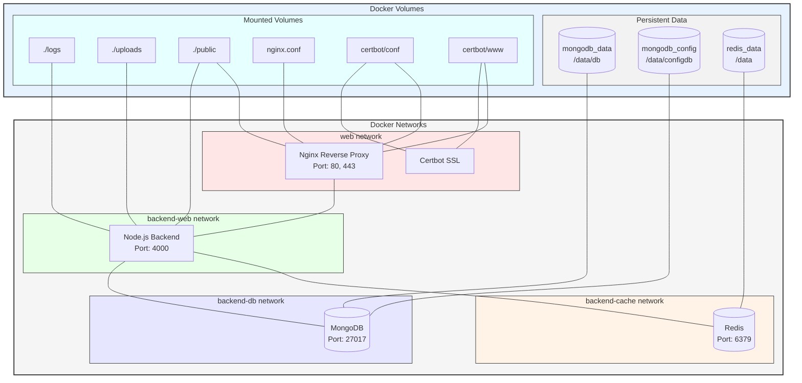

```mermaid
graph TB
    subgraph Networks["Docker Networks"]
        subgraph web["web network"]
            N[Nginx Reverse Proxy<br/>Port: 80, 443]
            C[Certbot SSL]
        end
        
        subgraph backend-web["backend-web network"]
            N --- B[Node.js Backend<br/>Port: 4000]
        end
        
        subgraph backend-db["backend-db network"]
            B --- M[(MongoDB<br/>Port: 27017)]
        end
        
        subgraph backend-cache["backend-cache network"]
            B --- R[(Redis<br/>Port: 6379)]
        end
    end
    
    subgraph Volumes["Docker Volumes"]
        subgraph Persistent["Persistent Data"]
            MD[("mongodb_data<br/>/data/db")] --- M
            MC[("mongodb_config<br/>/data/configdb")] --- M
            RD[("redis_data<br/>/data")] --- R
        end
        
        subgraph Mounted["Mounted Volumes"]
            L["./logs"] --- B
            U["./uploads"] --- B
            P["./public"] --- B & N
            NC["nginx.conf"] --- N
            CC["certbot/conf"] --- C & N
            CW["certbot/www"] --- C & N
        end
    end
    
    style Networks fill:#f5f5f5,stroke:#333,stroke-width:2px
    style Volumes fill:#e6f3ff,stroke:#333,stroke-width:2px
    style web fill:#ffe6e6,stroke:#333
    style backend-web fill:#e6ffe6,stroke:#333
    style backend-db fill:#e6e6ff,stroke:#333
    style backend-cache fill:#fff2e6,stroke:#333
    style Persistent fill:#f2f2f2,stroke:#333
    style Mounted fill:#e6ffff,stroke:#333
```
