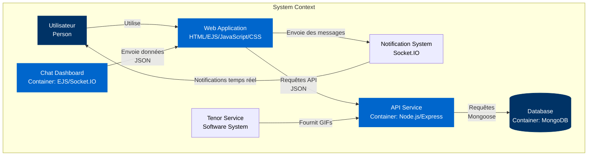
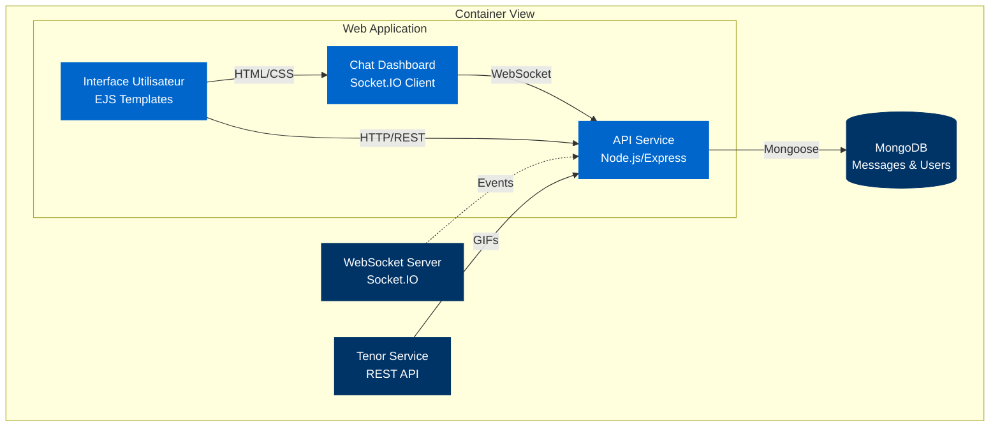
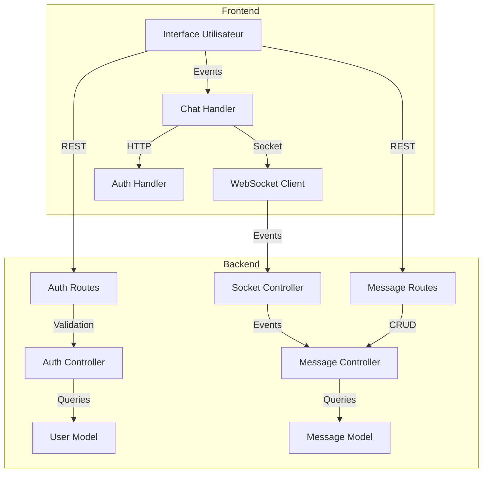
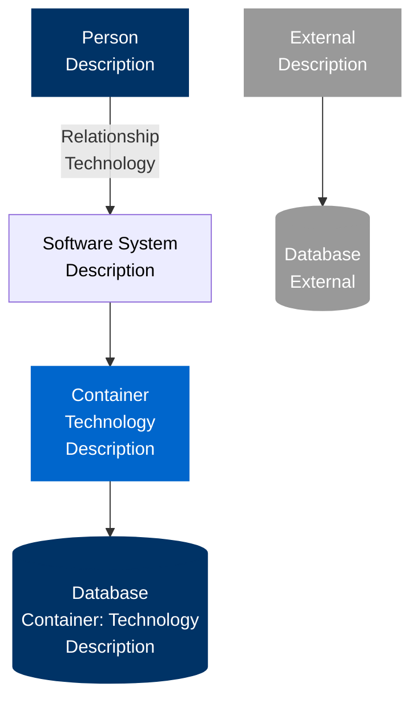

# Modélisation de l'Architecture Missi-Moustache-Web

## 1. Diagramme de Contexte (C4 - Niveau 1)



## 2. Diagramme de Conteneurs (C4 - Niveau 2)



## 3. Diagramme de Composants (C4 - Niveau 3)



## 4. Modèle Relationnel (MongoDB)

### Collection: utilisateur
```javascript
{
  _id: ObjectId,
  nom_complet: String,
  username: String unique,
  email: String unique,
  password: String (hashed),
  statut: Number (0=offline, 1=online),
  createdAt: Date
}
```

### Collection: message
```javascript
{
  _id: ObjectId,
  senderId: ObjectId (ref: utilisateur),
  receiverId: ObjectId (ref: utilisateur),
  content: String,
  type: String enum['text', 'audio'],
  isRead: Boolean,
  timestamp: Date
}
```

## 5. Script de Création MongoDB

```javascript
// Création de la base de données
use ndao_iresaka

// Collection utilisateur avec validation
db.createCollection("utilisateur", {
   validator: {
      $jsonSchema: {
         bsonType: "object",
         required: ["nom_complet", "username", "email", "password"],
         properties: {
            nom_complet: {
               bsonType: "string",
               description: "Nom complet de l'utilisateur - obligatoire"
            },
            username: {
               bsonType: "string",
               description: "Nom d'utilisateur unique - obligatoire"
            },
            email: {
               bsonType: "string",
               pattern: "^[a-zA-Z0-9._%+-]+@[a-zA-Z0-9.-]+\\.[a-zA-Z]{2,}$",
               description: "Email valide - obligatoire"
            },
            password: {
               bsonType: "string",
               description: "Mot de passe hashé - obligatoire"
            },
            statut: {
               bsonType: "int",
               minimum: 0,
               maximum: 1,
               description: "0=hors ligne, 1=en ligne"
            },
            createdAt: {
               bsonType: "date",
               description: "Date de création du compte"
            }
         }
      }
   }
})

// Collection message avec validation
db.createCollection("message", {
   validator: {
      $jsonSchema: {
         bsonType: "object",
         required: ["senderId", "receiverId", "content", "type"],
         properties: {
            senderId: {
               bsonType: "objectId",
               description: "ID de l'expéditeur - obligatoire"
            },
            receiverId: {
               bsonType: "objectId",
               description: "ID du destinataire - obligatoire"
            },
            content: {
               bsonType: "string",
               description: "Contenu du message - obligatoire"
            },
            type: {
               enum: ["text", "audio"],
               description: "Type de message - obligatoire"
            },
            isRead: {
               bsonType: "bool",
               description: "Statut de lecture du message"
            },
            timestamp: {
               bsonType: "date",
               description: "Date d'envoi du message"
            }
         }
      }
   }
})

// Index pour optimiser les recherches
db.utilisateur.createIndex({ "email": 1 }, { unique: true })
db.utilisateur.createIndex({ "username": 1 }, { unique: true })
db.message.createIndex({ "senderId": 1, "receiverId": 1, "timestamp": -1 })
```

## 6. Description de l'Architecture

### Frontend (EJS + JavaScript)
- Interface utilisateur responsive
- Gestion des événements en temps réel
- Communication WebSocket avec Socket.IO
- Authentification JWT

### Backend (Node.js + Express)
- API RESTful
- Authentification JWT
- WebSocket avec Socket.IO
- Gestion des messages en temps réel
- Stockage MongoDB

### Base de données (MongoDB)
- Collections : utilisateur, message
- Relations via ObjectId
- Indexation pour les performances
- Validation des schémas

## Légende


